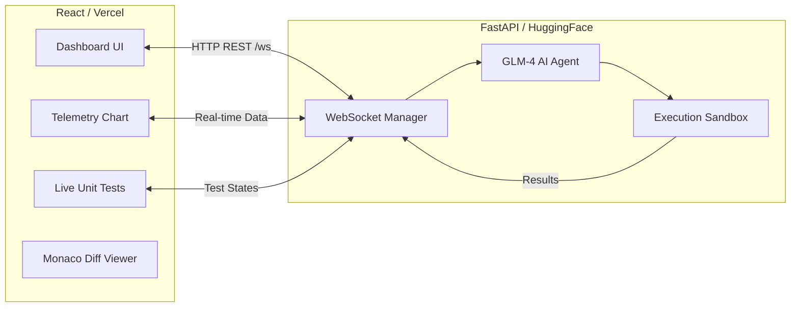

<div align="center">
  
  
  
  

  <br />
  <br />

  <h1>CORE SRE </h1>
  <h3>Autonomous AI Recovery System</h3>
  <p>A next-generation, self-healing infrastructure dashboard that detects, analyzes, and autonomously patches critical vulnerabilities in real-time.</p>

  <br />
</div>

## 🚀 Overview

**CORE SRE** is an enterprise-grade Autonomous Site Reliability Engineering (SRE) engine. It bridges the gap between observability and automated incident response by utilizing a real-time WebSocket architecture and Large Language Models (GLM-4) to autonomously detect system failures, generate heuristic code patches, and deploy fixes with human-in-the-loop approval.

This project demonstrates advanced full-stack capabilities, real-time data synchronization, dynamic state management, and modern UI/UX design paradigms.

## ✨ Key Features

- **Live Telemetry & Traffic Modeling**: Custom-built SVG charting system implementing a constrained random-walk algorithm to simulate live financial gateway traffic and error rates with zero-latency rendering.
- **Real-Time Unit Test Matrix**: Live-updating test suite grid that syncs with backend heuristics via WebSockets to visually demonstrate test failures and autonomous test restoration.
- **Monaco Engine Code Diffing**: Integrated Microsoft Monaco Editor (VS Code engine) displaying real-time code diffs (`oldCode` vs `newCode`) of the AI-generated patches before deployment.
- **Asynchronous WebSocket Architecture**: Fully decoupled architecture where the FastAPI backend streams audit logs, sandbox metrics, and deployment statuses directly to the React frontend.
- **Human-in-the-Loop (HITL) Workflow**: Enforces strict deployment gates. The AI generates the patch, but human approval is required before the automated regression tests and production deployment phase begin.

## 🛠️ Technology Stack

**Frontend (Client Node)**
- React 19 + Vite
- Tailwind CSS v4 (Custom dark mode tokens, micro-animations)
- Framer Motion (State transitions)
- Monaco Editor (Code diffing and syntax highlighting)
- Custom SVG Data Visualizations

**Backend (Agent Node)**
- Python 3.10+
- FastAPI (REST & WebSocket endpoints)
- Uvicorn (ASGI Server)
- LiteLLM (LLM Abstraction Layer)

**Infrastructure / DevOps**
- Vercel (Edge Frontend Deployment)
- HuggingFace Spaces (Dockerized Backend Deployment)
- Git (Version Control)

## 🏗️ System Architecture



## 💻 Local Development

### Prerequisites
- Node.js 18+
- Python 3.10+

### 1. Start the Backend (FastAPI)
```bash
# Clone the repository
git clone https://github.com/Chandann-23/core-sre-agent.git
cd core-sre-agent

# Install Python dependencies
pip install -r requirements.txt

# Start the FastAPI server (runs on port 7860)
python simple_api.py
```

### 2. Start the Frontend (React/Vite)
```bash
# Open a new terminal tab
cd core-sre-agent/frontend

# Install NPM dependencies
npm install

# Start the Vite development server
npm run dev
```
Navigate to `http://localhost:5173` to view the dashboard.

## 🔒 Environment Variables

To enable the autonomous AI patch generation, you need to provide a valid API key. If no key is provided, the system gracefully falls back to a deterministic **Mock Repair Mode** for demonstration purposes.

```env
ZHIPUAI_API_KEY=your_api_key_here
```

To configure the frontend to point to a specific backend in production, set the following environment variable in your Vercel deployment:
```env
VITE_API_URL=https://your-backend-url.com
```
*(Note: The frontend automatically detects the `PROD` environment and defaults to the HuggingFace backend space).*

---
<div align="center">
  <i>Engineered for Next-Gen Infrastructure.</i>
</div>
